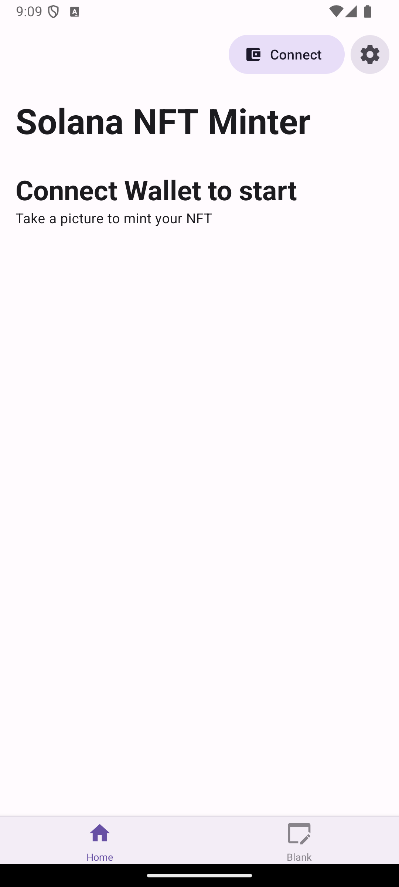
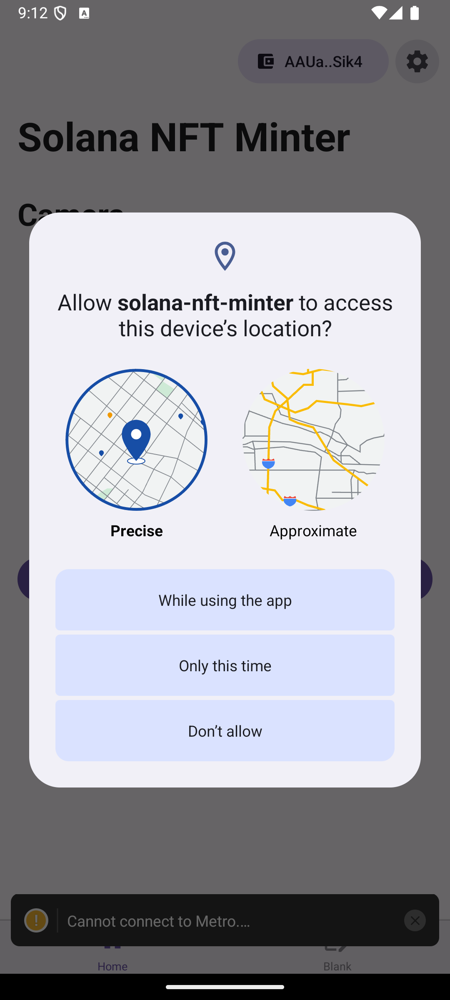
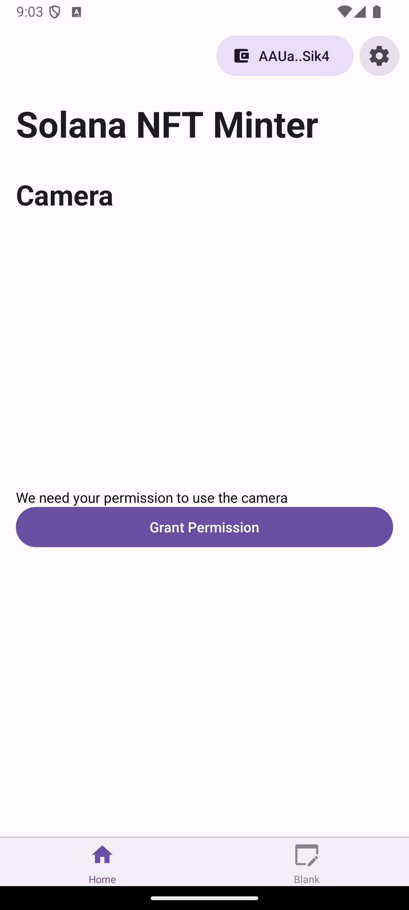
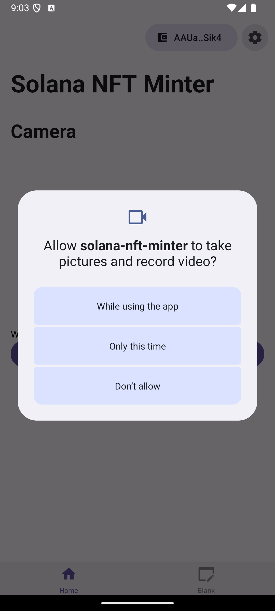
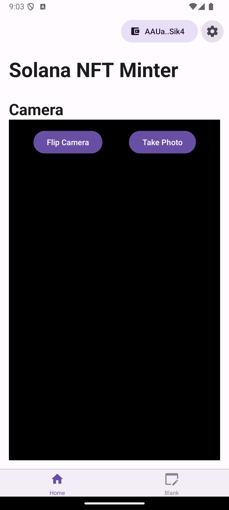
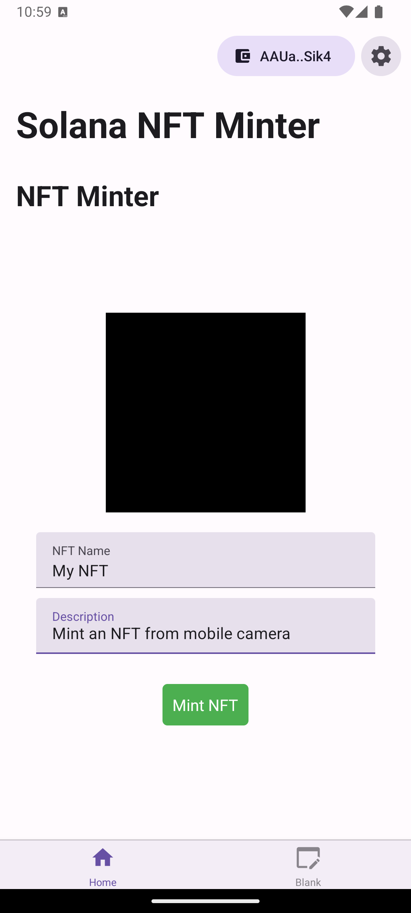

# Solana NFT Minter

## This project is built on top of [Solana Mobile Expo Template](https://github.com/solana-mobile/solana-mobile-expo-template)

<table>
  <tr>
    <td align="center">
      
    </td>
    <td align="center">
      
    </td>
    <td align="center">
      
    </td>
  </tr>
  <tr>
    <td align="center">
      
    </td>
    <td align="center">
      
    </td>
    <td align="center">
      
    </td>
  </tr>
</table>

## Tech Stack

| Library               | Category          | Version | Description                                           |
| --------------------- | ----------------- | ------- | ----------------------------------------------------- |
| React Native          | Mobile Framework  | v0.73   | The best cross-platform mobile framework              |
| Expo                  | SDK               | v50     | Allows (optional) Expo modules                        |
| React                 | UI Framework      | v18     | The most popular UI framework in the world            |
| Mobile Wallet Adapter | SDK               | v2.0    | Connect and request signing from mobile wallet apps   |
| Solana web3.js        | SDK               | v1.78   | General Solana library for transactions and RPCs      |
| spl-token             | SDK               | v0.41   | Library for building with Solana SPL tokens           |
| React Native Paper    | Component Library | v18     | Production-ready components following Material Design |
| React Navigation      | Navigation        | v6      | Performant and consistent navigation framework        |
| React Query           | State management  | v5.24   | Async query management                                |
| TypeScript            | Language          | v5      | Static typechecking                                   |
| AsyncStorage          | Persistence       | v1      | State persistence                                     |

## Quick Start

### Prerequisites

- A free [Expo](https://expo.dev/) account.
- An Android device/emulator to test your app
  - Install an MWA compliant wallet app on your device/emulator.
- If using Expo's cloud service `eas build`, no further setup is required.
- If building locally:
  - React Native and Android Envrionment
    [setup](https://docs.solanamobile.com/getting-started/development-setup)

### Initialize

Run the CLI command:

```
yarn create expo-app --template @solana-mobile/solana-mobile-expo-template
```

Choose your project name then navigate into the directory.

### Build and run the app

Once your app is initialized, follow the
**["Running the app"](https://docs.solanamobile.com/react-native/expo#running-the-app)**
guide to launch the template as a custom development build.

## Caveats

- This is only fully functional on Android. iOS is not supported.
- This project uses the `expo-camera` plugin, which is not supported in Android
  emulators for Expo v50.0.0 or earlier. Testing must be done on a physical
  Android device. For more information, see
  [platform-compatibility](https://docs.expo.dev/versions/v50.0.0/sdk/camera/#platform-compatibility)

## Existing Issues

- `@metaplex-foundation/js` was deprecated and `bundlrStorage` was removed. Thus
  image upload is not working.
- Migrating to newer versions of the Metaplex SDK is recommended.
- [more info](https://github.com/metaplex-foundation/js?tab=readme-ov-file#metaplex-javascript-sdk)
- [reference](https://developers.metaplex.com/token-metadata/guides/javascript/create-an-nft)
